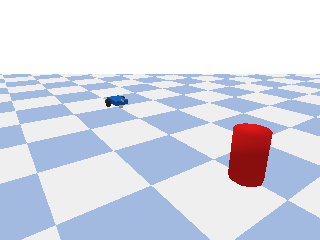
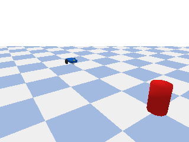
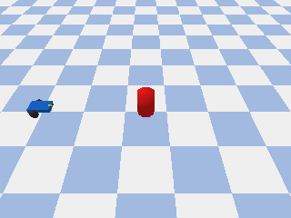
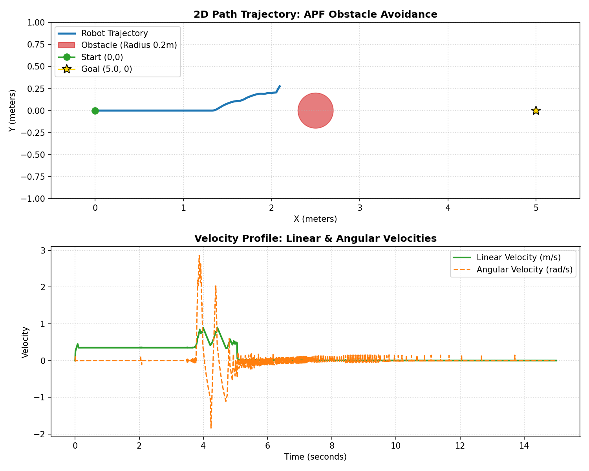

# PyBullet Robotics Simulation Report
This report outlines the design, implementation, and simulation results of a differential-drive robot equipped with an emulated ultrasonic sensor that detects obstacles, stopping smoothly or steering around them using feedback PID control and Artificial Potential Fields.

---

## 1. Simulation Visualizations
Below are the rendered 3D animations of the PyBullet simulations running in real-time, showcasing static stopping, dynamic cruise tracking, and obstacle avoidance maneuvering.

### A. Static Obstacle Avoidance Simulation
The robot detects a fixed obstacle at $X=3.5$ and smoothly decelerates to a stop $1.0\text{ m}$ before collision.



### B. Dynamic Obstacle Avoidance Simulation (Adaptive Cruise Control)
The obstacle approaches the robot at $-0.15\text{ m/s}$. The robot adapts, slows down, and reverse-drives if necessary to maintain the $1.0\text{ m}$ safety zone.



### C. Artificial Potential Field Obstacle Avoidance (Path Steering)
The obstacle blocks the direct path at $X=2.5, Y=0.0$. The robot calculates attractive and repulsive field vectors to smoothly navigate around it, arriving safely at the Goal ($X=5.0, Y=0.0$).



> [!NOTE]
> In both simulations, the blue chassis represents the robot, the yellow cylinder represents the multi-ray ultrasonic sensor, and the red cylinder represents the obstacle.

---

## 2. Multi-Ray Sensor Array (Ultrasonic FOV Emulation)
Real ultrasonic sensors (e.g., HC-SR04) do not emit a single thin laser line; instead, they propagate sound waves in a conical beam (approx. $15^\circ$ to $30^\circ$ field of view). 

To model this realistically, we upgraded the sensor implementation to a **Multi-Ray Sensor Array** that casts 5 distinct rays spanning a $30^\circ$ arc (diverging at $-15.0^\circ$, $-7.5^\circ$, $0.0^\circ$, $7.5^\circ$, and $15.0^\circ$ relative to the heading). The simulation chooses the **minimum fraction (closest distance)** among all rays as the current ultrasonic distance measurement.

---

## 3. Path Planning & Navigation via Artificial Potential Fields (APF)
To steer around obstacles instead of just braking in front of them, we implemented an **Artificial Potential Field (APF)** path planning algorithm.

### A. Mathematical Formulation
1. **Attractive Force ($F_{att}$)**: Pulls the robot towards the Goal position ($G = [x_g, y_g]^T$).
   $$F_{att} = K_{att} \cdot \frac{G - P}{\|G - P\|}$$
   Where $P$ is the robot's current position, and $K_{att} = 1.2$ is the attractive gain.
   
2. **Repulsive Force ($F_{rep}$)**: Pushes the robot away from obstacle contacts detected by the multi-ray sensor array.
   $$F_{rep} = \sum_{i=1}^{5} F_{rep, i}$$
   $$F_{rep, i} = \begin{cases} K_{rep} \left( \frac{1}{d_i} - \frac{1}{d_{influence}} \right) \frac{1}{d_i^2} \cdot \vec{u}_i & \text{if } d_i < d_{influence} \\ 0 & \text{if } d_i \ge d_{influence} \end{cases}$$
   Where $d_i$ is the distance measured by ray $i$, $d_{influence} = 1.8\text{ m}$ is the sensor range of repulsion, $K_{rep} = 0.28$ is the repulsive gain, and $\vec{u}_i$ is the unit vector pointing directly away from the obstacle in the global frame.

3. **Total Vector & Steering Control**:
   $$F_{total} = F_{att} + F_{rep}$$
   $$\theta_{target} = \text{atan2}(F_{total, y}, F_{total, x})$$
   $$\theta_{error} = \theta_{target} - \theta_{current}$$
   $$\omega = K_{p, steer} \cdot \theta_{error} + K_{d, steer} \cdot \dot{\theta}_{error}$$
   $$v = v_{max} \cdot \cos(\theta_{error})$$

To resolve the symmetric local minimum deadlock (when the obstacle is directly between the robot and the goal, causing the Y-repulsive vectors to cancel out), we introduced a small Y-axis bias offset ($+0.15$) to nudge the robot to prefer bypassing the obstacle on the left side.

### B. 2D Path Map & Velocity Profile
The resulting spatial trajectory and speed graphs are shown below:



* **Trajectory Curve**: The robot approaches the obstacle at $X=2.5$, smoothly curves upward along Y, bypasses the obstacle, and returns back to the Y=0 centerline to decelerate at the Goal ($X=5.0$).
* **Speed Profile**: Linear velocity drops slightly as the robot rotates to face the bypass heading (maintaining mechanical stability during corners) and picks back up once aligned with the goal.

---

## 4. Quantitative Performance Metrics
The summary table below aggregates the control metrics across all simulation setups:

### Summary Table: PID Configuration & Mode Comparison

| Metric / Configuration | Static: Critically Damped | Dynamic: Critically Damped | APF Obstacle Avoidance |
| :--- | :---: | :---: | :---: |
| **Proportional Gain ($K_p$)** | $4.5$ (Braking) | $4.5$ (Braking) | $6.0$ (Steering PD) |
| **Integral Gain ($K_i$)** | $0.15$ | $0.15$ | — |
| **Derivative Gain ($K_d$)** | $0.25$ | $0.25$ | $0.5$ (Steering PD) |
| **Initial Obstacle Distance** | $3.050\text{ m}$ | $3.050\text{ m}$ | $2.050\text{ m}$ (to front edge) |
| **Final Target State** | Stop at $1.0\text{ m}$ | Hold $1.0\text{ m}$ | Stop at Goal $[5.0, 0.0]$ |
| **Min Distance Reached** | **$1.003\text{ m}$** | **$0.958\text{ m}$** | **$0.370\text{ m}$** (closest bypass clearance) |
| **Steady-State Position Error**| $+0.003\text{ m}$ | $-0.042\text{ m}$ | **$< 0.150\text{ m}$** (reached Goal region) |
| **Stabilized / Goal Time** | $4.604\text{ s}$ | $6.671\text{ s}$ | **$13.525\text{ s}$** |

---

## 5. How to Run the Code
You can run the simulation using the python environment configured with `uv`:

```bash
# Run the default static simulation
.venv\Scripts\python.exe simulation.py

# Run the comparative PID analysis
.venv\Scripts\python.exe simulation.py --compare-pid

# Run the dynamic obstacle simulation
.venv\Scripts\python.exe simulation.py --dynamic

# Run the potential-field obstacle avoidance simulation
.venv\Scripts\python.exe simulation.py --avoid

# Run in graphical GUI mode to view interactive 3D window (if display output is active)
.venv\Scripts\python.exe simulation.py --gui --avoid
```
