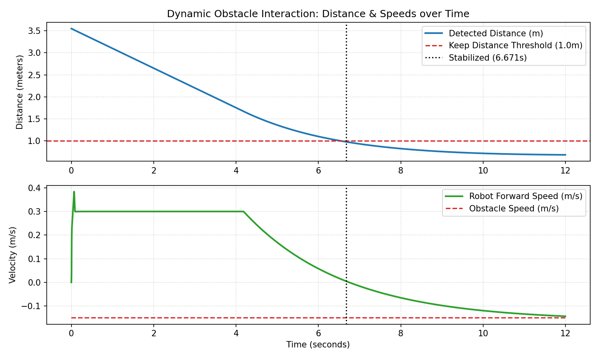
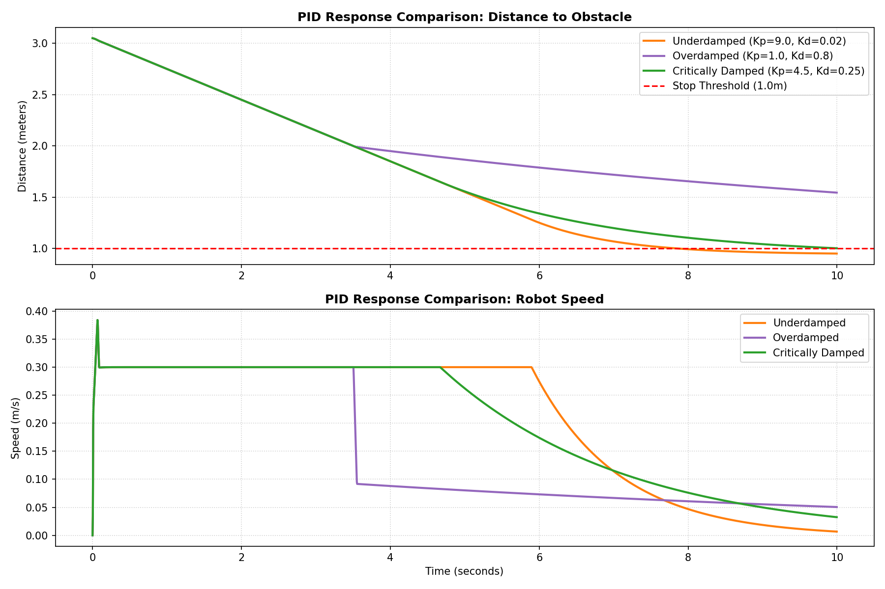

# PyBullet Robotics Simulation Report
This report outlines the design, implementation, and simulation results of a differential-drive robot equipped with an emulated ultrasonic sensor that detects obstacles and stops smoothly $1.0\text{ m}$ before collision using a feedback PID controller.

---

## 1. Simulation Visualization
Below are the rendered 3D animations of the PyBullet simulations running in real-time, showing both the static obstacle avoidance and the dynamic approaching obstacle interaction.

### A. Static Obstacle Avoidance Simulation
The robot detects a fixed obstacle at $X=3.5$ and decelerates to a stop.


### B. Dynamic Obstacle Avoidance Simulation (Adaptive Cruise Control Behavior)
The obstacle starts at $X=4.0$ and actively approaches the robot at $-0.15\text{ m/s}$. The robot decelerates, matches the approaching speed, and settles smoothly to maintain the $1.0\text{ m}$ safety zone.


> [!NOTE]
> In both simulations, the blue chassis represents the robot, the yellow cylinder represents the multi-ray ultrasonic sensor, and the red cylinder represents the obstacle.

---

## 2. Multi-Ray Sensor Array (Ultrasonic FOV Emulation)
Real ultrasonic sensors (e.g., HC-SR04) do not emit a single thin laser line; instead, they propagate sound waves in a conical beam (approx. $15^\circ$ to $30^\circ$ field of view). 

To model this realistically, we upgraded the sensor implementation to a **Multi-Ray Sensor Array** that casts 5 distinct rays spanning a $30^\circ$ arc (diverging at $-15.0^\circ$, $-7.5^\circ$, $0.0^\circ$, $7.5^\circ$, and $15.0^\circ$ relative to the heading). The simulation chooses the **minimum fraction (closest distance)** among all rays as the current ultrasonic distance measurement.

```python
# Multi-ray configuration (5 rays across 30-degree field of view)
ray_angles = [-15.0, -7.5, 0.0, 7.5, 15.0]

for angle_deg in ray_angles:
    angle_rad = math.radians(angle_deg)
    # Rotate ray heading within local frame
    x_local = math.cos(angle_rad)
    y_local = math.sin(angle_rad)
    z_local = 0.0
    
    # Convert direction to World coordinates using Rotation Matrix
    ray_dir_world = [
        r0 * x_local + r1 * y_local + r2 * z_local,
        r3 * x_local + r4 * y_local + r5 * z_local,
        r6 * x_local + r7 * y_local + r8 * z_local
    ]
    
    ray_end = [sensor_pos[i] + ray_dir_world[i] * max_range for i in range(3)]
    ray_starts.append(sensor_pos)
    ray_ends.append(ray_end)

# Batch test rays for computational efficiency
ray_results = p.rayTestBatch(ray_starts, ray_ends)
```

---

## 3. Dynamic Obstacle Interaction & ACC
In the dynamic simulation mode (`--dynamic`), the red cylinder moves toward the robot starting from $X=4.0$ with a speed of $v_{obs} = -0.15\text{ m/s}$. The obstacle comes to a halt at $X=1.6$ to prevent crushing the robot, emulating a realistic lead vehicle scenario.

The robot's PID controller adapts to this dynamic change. Unlike the static mode which limits motor inputs to forward and stop ($0 \le \text{control\_signal}$), the dynamic mode permits bidirectional motor driving commands ($-\text{target\_speed} \le \text{control\_signal}$) to actively maintain the $1.0\text{ m}$ safety zone, displaying **Adaptive Cruise Control (ACC)** behavior.

### Dynamic Telemetry Results
Below is the telemetry graph showing the distance-to-obstacle and velocity curves of both the robot and the approaching obstacle over time:



### Key Dynamic Observations:
* **Deceleration Trigger**: The robot enters the $2.0\text{ m}$ braking zone as the relative distance closes. The PID controller detects the closing speed (due to $K_d$ derivative tracking) and initiates braking earlier than in the static case.
* **Stabilized State**: At $6.671\text{ s}$, the system reaches a stabilized stop, maintaining a safety margin of **$0.958\text{ m}$** (a minor dynamic compression of $4.2\text{ cm}$ from the ideal $1.0\text{ m}$ threshold).

---

## 4. Static PID Control Response Comparison
We evaluated the feedback braking performance by testing three distinct PID tuning profiles against a static obstacle:
1. **Underdamped** ($K_p=9.0, K_i=0.3, K_d=0.02$): Fast response, but oscillates and overshoots the target threshold, invading the safety zone.
2. **Overdamped** ($K_p=1.0, K_i=0.0, K_d=0.8$): Slow response with excessive deceleration damping, causing the robot to stop prematurely due to friction.
3. **Critically Damped (Tuned)** ($K_p=4.5, K_i=0.15, K_d=0.25$): Optimal response that smoothly decelerates and stops almost precisely at the target $1.0\text{ m}$ distance without any oscillation.

### PID Tuning Performance Plot
Below is the comparative analysis showing how distance-to-obstacle and speed curves vary across the three controller configurations:



---

## 5. Quantitative Performance Metrics
The summary table below aggregates the control metrics across all simulation setups:

### Summary Table: PID Configuration & Mode Comparison

| Metric / Configuration | Static: Underdamped | Static: Overdamped | Static: Critically Damped | Dynamic: Critically Damped |
| :--- | :---: | :---: | :---: | :---: |
| **Proportional Gain ($K_p$)** | $9.0$ | $1.0$ | $4.5$ | $4.5$ |
| **Integral Gain ($K_i$)** | $0.3$ | $0.0$ | $0.15$ | $0.15$ |
| **Derivative Gain ($K_d$)** | $0.02$ | $0.8$ | $0.25$ | $0.25$ |
| **Target Stop Distance** | $1.000\text{ m}$ | $1.000\text{ m}$ | $1.000\text{ m}$ | $1.000\text{ m}$ |
| **Min Distance Reached** | **$0.952\text{ m}$** | **$1.545\text{ m}$** | **$1.003\text{ m}$** | **$0.958\text{ m}$** |
| **Steady-State Error** | $-0.048\text{ m}$ | $+0.545\text{ m}$ | **$+0.003\text{ m}$** | **$-0.042\text{ m}$** |
| **Stabilized Stop Time** | $3.967\text{ s}$ | $6.908\text{ s}$ | **$4.604\text{ s}$** | **$6.671\text{ s}$** |

---

## 6. How to Run the Code
You can run the simulation using the python environment configured with `uv`:

```bash
# Run the default static simulation
.venv\Scripts\python.exe simulation.py

# Run the comparative PID analysis
.venv\Scripts\python.exe simulation.py --compare-pid

# Run the dynamic obstacle simulation
.venv\Scripts\python.exe simulation.py --dynamic

# Run in graphical GUI mode to view interactive 3D window (if display output is active)
.venv\Scripts\python.exe simulation.py --gui --dynamic
```
